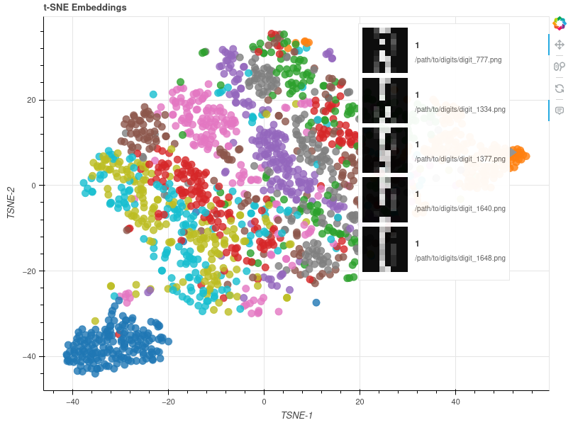

# Data Analysis using TSNE + Bokeh on toy image dataset

#### The code purpose is:
- Perform TSNE and display the source image, the label of the image, and the path of the source image (path need adjustment)
- Embed the images using CLIP
- Perform PCA if param value chosen is greater then 0
- Provide a nice starting point to clean TSNE pipleline, just edit the configuration cells below to change dataset and parametes
- Import the plot to sharable interactive and HTML file if output_path is specified

#### Output example:
Download: 
<br>Quick png visualization of the output on mouse hover:


<!--
TODO: 
#### Fully Interactive Version  
Click the badge below to step into the real-time dashboard with all interactive tooling enabled:  
[](https://<your-username>.github.io/<your-repo>/interactive_daily_sales.html)
-->

#### Requirements: (04.06.25)
- Python 3.12.10
- Python libraries, as written in requirements.txt:
```
Package                   Version
------------------------- --------------
anyio                     4.9.0
anywidget                 0.9.18
argon2-cffi               23.1.0
argon2-cffi-bindings      21.2.0
arrow                     1.3.0
asttokens                 3.0.0
async-lru                 2.0.5
attrs                     25.3.0
babel                     2.17.0
beautifulsoup4            4.13.4
bleach                    6.2.0
blinker                   1.9.0
bokeh                     3.7.3
certifi                   2025.4.26
cffi                      1.17.1
charset-normalizer        3.4.2
click                     8.2.1
clip                      1.0
comm                      0.2.2
contourpy                 1.3.2
cycler                    0.12.1
dash                      3.0.4
debugpy                   1.8.14
decorator                 5.2.1
defusedxml                0.7.1
executing                 2.2.0
fastjsonschema            2.21.1
filelock                  3.13.1
filetype                  1.2.0
Flask                     3.0.3
fonttools                 4.58.1
fqdn                      1.5.1
fsspec                    2024.6.1
ftfy                      6.3.1
h11                       0.16.0
hdbscan                   0.8.40
hf-xet                    1.1.2
httpcore                  1.0.9
httpx                     0.28.1
huggingface-hub           0.32.2
idna                      3.7
importlib_metadata        8.7.0
ipykernel                 6.29.5
ipython                   9.2.0
ipython_pygments_lexers   1.1.1
ipywidgets                8.1.7
isoduration               20.11.0
itsdangerous              2.2.0
jedi                      0.19.2
Jinja2                    3.1.4
joblib                    1.5.1
json5                     0.12.0
jsonpointer               3.0.0
jsonschema                4.24.0
jsonschema-specifications 2025.4.1
jupyter_client            8.6.3
jupyter_core              5.8.1
jupyter-events            0.12.0
jupyter-lsp               2.2.5
jupyter_server            2.16.0
jupyter_server_terminals  0.5.3
jupyterlab                4.4.3
jupyterlab_pygments       0.3.0
jupyterlab_server         2.27.3
jupyterlab_widgets        3.0.15
kiwisolver                1.4.8
llvmlite                  0.44.0
MarkupSafe                2.1.5
matplotlib                3.10.3
matplotlib-inline         0.1.7
mistune                   3.1.3
mpmath                    1.3.0
narwhals                  1.41.0
nbclient                  0.10.2
nbconvert                 7.16.6
nbformat                  5.10.4
nest-asyncio              1.6.0
networkx                  3.3
notebook                  7.4.3
notebook_shim             0.2.4
numba                     0.61.2
numpy                     2.1.2
nvidia-cublas-cu12        12.6.4.1
nvidia-cuda-cupti-cu12    12.6.80
nvidia-cuda-nvrtc-cu12    12.6.77
nvidia-cuda-runtime-cu12  12.6.77
nvidia-cudnn-cu12         9.5.1.17
nvidia-cufft-cu12         11.3.0.4
nvidia-curand-cu12        10.3.7.77
nvidia-cusolver-cu12      11.7.1.2
nvidia-cusparse-cu12      12.5.4.2
nvidia-cusparselt-cu12    0.6.3
nvidia-nccl-cu12          2.21.5
nvidia-nvjitlink-cu12     12.6.85
nvidia-nvtx-cu12          12.6.77
opencv-python             4.11.0.86
opencv-python-headless    4.10.0.84
overrides                 7.7.0
packaging                 25.0
pandas                    2.2.3
pandocfilters             1.5.1
parso                     0.8.4
pexpect                   4.9.0
pillow                    11.0.0
pillow_heif               0.22.0
pip                       25.1.1
platformdirs              4.3.8
plotly                    6.1.2
prometheus_client         0.22.0
prompt_toolkit            3.0.51
psutil                    7.0.0
psygnal                   0.13.0
ptyprocess                0.7.0
pure_eval                 0.2.3
pycparser                 2.22
Pygments                  2.19.1
pynndescent               0.5.13
pyparsing                 3.2.3
python-dateutil           2.9.0.post0
python-dotenv             1.1.0
python-json-logger        3.3.0
pytz                      2025.2
PyYAML                    6.0.2
pyzmq                     26.4.0
referencing               0.36.2
regex                     2024.11.6
requests                  2.32.3
requests-toolbelt         1.0.0
retrying                  1.3.4
rfc3339-validator         0.1.4
rfc3986-validator         0.1.1
roboflow                  1.1.64
rpds-py                   0.25.1
safetensors               0.5.3
scikit-learn              1.6.1
scipy                     1.15.3
Send2Trash                1.8.3
setuptools                70.2.0
six                       1.17.0
sniffio                   1.3.1
soupsieve                 2.7
stack-data                0.6.3
supervision               0.25.1
sympy                     1.13.1
terminado                 0.18.1
threadpoolctl             3.6.0
tinycss2                  1.4.0
tokenizers                0.21.1
torch                     2.6.0+cu126
torchaudio                2.6.0+cu126
torchvision               0.21.0+cu126
tornado                   6.5.1
tqdm                      4.67.1
traitlets                 5.14.3
transformers              4.52.3
triton                    3.2.0
types-python-dateutil     2.9.0.20250516
typing_extensions         4.12.2
tzdata                    2025.2
umap-learn                0.5.7
uri-template              1.3.0
urllib3                   2.4.0
wcwidth                   0.2.13
webcolors                 24.11.1
webencodings              0.5.1
websocket-client          1.8.0
Werkzeug                  3.0.6
widgetsnbextension        4.0.14
xyzservices               2025.4.0
zipp                      3.22.0
```
